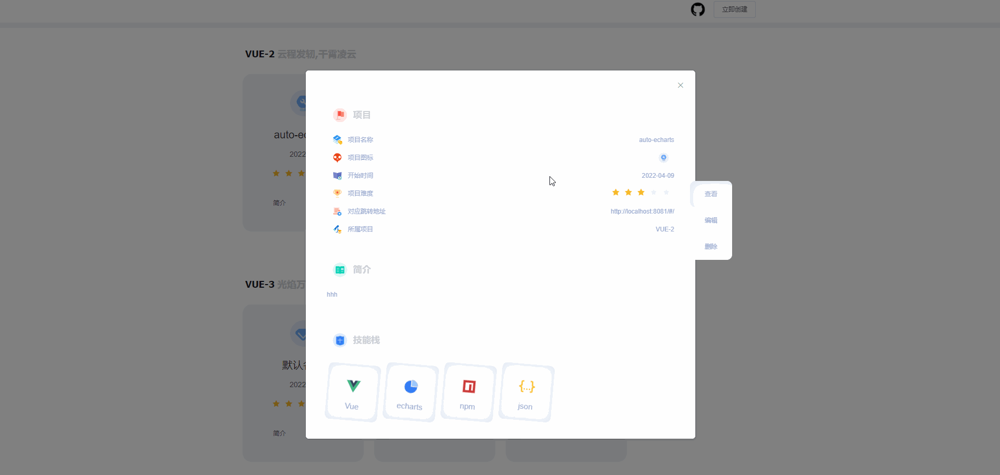

# 前端项目展示界面 | 基于Vue

> 作者喜欢在Github上面学习项目，于是做了这个展示界面用于快速记录项目，方便以后自己或他人查看🤧

💎 **如果还行的话请给个star 🤗** 

<br/>

<div align="center">
	<a href="http://www.hongyadong.club/#/"></a>
	<a href="#"></a>
	<a href="http://www.hongyadong.club/#/"></a>
	<a href="#"></a>
	<a href="https://github.com/WuDuShanCheng/front-show"></a>
</div>

<br/>  
     

## 🏂 页面效果
1️⃣ 查看项目

</br>
2️⃣ 新建项目

3️⃣ 修改项目

另外支持项目的`删除`♻️ 这里就不做过多展示

## 🚅 安装
#### 前端

``` bash 
 # 下载数据包
 npm install 
 # 运行项目 默认端口8080 
 npm run serve 
 ``` 
 
 #### 后端
``` bash 
 # 建立名为shan_cheng的数据库 数据库文件在shan_cheng_service项目中
 # 修改config.js中的数据库用户名和密码
 # 下载数据包
 npm install 
 # 运行项目 默认端口3000
 npm run start
 ``` 
